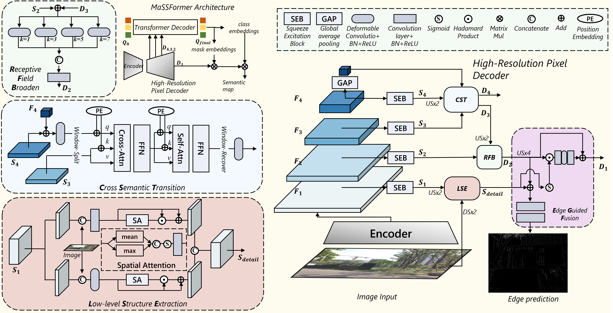

<h2>MaSS13K: A Matting-level Semantic Segmentation Benchmark</h2>

Chenxi Xie1,2
| Minghan Li1,2 | 
Hui Zeng1 | 
Jun Luo1,2 | 
Lei zhang1,2 

1The Hong Kong Polytechnic University, 2OPPO Research Institute

## ⏰ TODO
- [x] **2025.03.19**: Create repo.
- [ ] Release dataset.
- [ ] Release code.

## 🌟 MaSS13K Datasets

## 🌟 Our Framework

## MaSS13K-Benchmark

### Qualitative Comparison

### Quantitative Comparison

### License
This project is released under the [Apache 2.0 license](LICENSE).

### Acknowledgement

### Contact
If you have any questions, please contact: chenxi.xie@connect.polyu.hk

statistics

